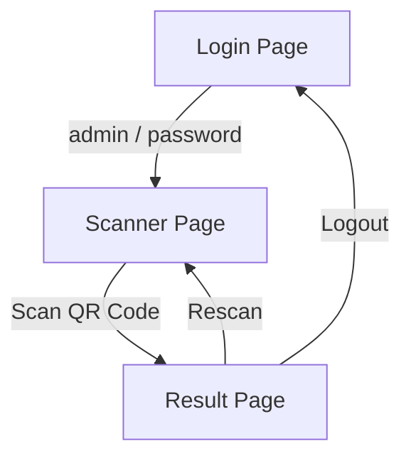

# PWA Scanner - Quick Setup Guide

## 🔐 Login Credentials
- **Username**: `admin`
- **Password**: `password`

---

## 📱 Phone Setup (3 Steps)

### 1. Access the Scanner
1. Open your phone's browser (Chrome/Safari recommended)
2. Go to your scanner URL: `https://your-scanner-url.com`
3. Tap "Add to Home Screen" (Chrome) or "Share" → "Add to Home Screen" (Safari)

### 2. Install PWA
- Android: Tap "Install" when prompted
- iPhone: Tap "Add" in the share menu
- App icon appears on your home screen

### 3. Allow Permissions
- Open the installed app
- Grant camera access when prompted
- Grant notification access (optional)

---

## 🔄 Application Flow

### Step-by-Step Flow:

1. **Login Page**
   - Enter credentials: `admin` / `password`
   - Tap "Login"
   - Redirects to scanner

2. **Scanner Page**
   - Camera activates automatically
   - Position QR code in the frame
   - App beeps/vibrates on successful scan
   - Auto-redirects to result page

3. **Result Page**
   - Shows scanned data (gatepass/challan info)
   - Displays status: "Success" or "Error"
   - Options:
     - **Scan Again**: Returns to scanner
     - **Logout**: Returns to login page

---

## 📸 How to Scan

1. Hold your phone 6-12 inches from QR code
2. Ensure QR code is fully visible in the frame
3. Keep hands steady until scan completes
4. Results appear in 1-2 seconds

---

## ⚠️ Troubleshooting

| Issue | Solution |
|-------|----------|
| Camera not working | Check permissions in phone settings |
| Scan fails | Clean camera lens, ensure good lighting |
| Login error | Verify credentials: `admin` / `password` |
| App not installing | Use Chrome/Safari browser |

---

## 💡 Pro Tips

- **Offline Mode**: Works without internet (scans queue when online)
- **Fast Access**: Add to phone home screen for 1-tap access
- **Multi-Scan**: Scan multiple items without returning to login
- **Battery Saver**: Close background apps for better camera performance

---

## 🔧 Requirements

- **Phone**: iOS 12.4+ or Android 8.0+
- **Browser**: Chrome 90+ or Safari 14+
- **Camera**: Minimum 5MP rear camera
- **Internet**: Required for first-time setup only

---

## 📞 Support

For issues:
1. Check permissions in phone settings
2. Reinstall PWA from browser
3. Contact IT: `support@yourcompany.com`